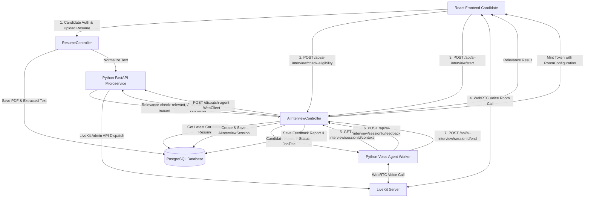

# 🎙️ LiveInterview

> A real-time interview platform that seamlessly connects **HR professionals** and **candidates** — featuring live human-to-human technical interviews with collaborative coding, as well as an **AI-powered Voice Mock Evaluator** with real-time feedback.

🌐 **Live Demo:** [live-interview-ten.vercel.app](https://live-interview-ten.vercel.app)

---

## 🚀 Features

- 🤖 **1:1 Voice AI Mock Interviewer** — Conduct interactive, full-duplex technical interviews with an AI Voice Agent (powered by LiveKit WebRTC, Groq Whisper STT, Gemini LLM, and Fish Audio TTS).
- ⚡ **Pre-flight Resume Relevance Screening** — Automated pre-check evaluating candidate resumes against target job titles before launching interviews.
- 📊 **Feedback & Transcript Persistence** — Automated generation and saving of post-interview evaluation reports.
- 📹 **Live Video Calls** — Real-time video communication between HR and candidates.
- 💻 **Collaborative Code Editor** — In-browser coding environment for technical rounds.
- 🔐 **Authentication & Security** — Secure JWT authentication for candidates and internal microservices.
- 📅 **Interview Session Management** — Schedule, join, track, and manage interview sessions.
- 🧑‍💼 **Role-based Access** — Separate dashboards and permissions for HR and candidates.
- 📱 **Responsive UI** — Clean, modern interface built with React.js and Lucide Icons.

---

## 🛠️ Tech Stack

| Layer          | Technology                                                 |
|----------------|------------------------------------------------------------|
| **Frontend**   | React.js, LiveKit Client SDK, Tailwind CSS, Lucide Icons   |
| **Backend**    | Spring Boot (Java 21), Spring Data JPA, WebClient, JWT     |
| **AI Agent**   | Python FastAPI, LiveKit Agents SDK, Groq, Gemini, Fish Audio|
| **Database**   | PostgreSQL / MySQL                                         |
| **Deployment** | Vercel (Frontend), Self-hosted / Cloud (Backend & Agent)   |

---

## 🔄 Project Architecture & Execution Flow



---

## 📁 Spring Boot Backend Structure

```
LiveInterview/
├── frontend/        # React.js web application
│   ├── src/
│   │   ├── Components/
│   │   │   ├── AiInterview/  # AI Voice Interview Entry & WebRTC Room
│   │   │   └── ...
│   │   └── Axios.js
│   └── package.json
│
└── backend/         # Spring Boot Backend (Java 21)
    ├── src/
    │   └── main/
    │       ├── java/LiveInterview/example/LiveInterview/
    │       │   ├── Config/
    │       │   │   ├── AppConfig.java
    │       │   │   ├── SecurityConfig.java         # Spring Security, CORS & JWT Auth
    │       │   │   └── WebSocketConfig.java        # STOMP / WebSocket Config
    │       │   ├── Controller/
    │       │   │   ├── AiInterviewController.java  # AI Session Lifecycle, Eligibility, Token Minting & Feedback
    │       │   │   ├── ResumeController.java       # Resume Upload & Parsing Endpoint
    │       │   │   ├── AuthController.java         # Candidate & HR Authentication
    │       │   │   ├── LiveKitWebhookController.java # LiveKit Event Handlers
    │       │   │   └── RoomController.java         # Human Video Rooms & Code Editor
    │       │   ├── Entity/
    │       │   │   ├── AiInterviewSession.java     # Session Entity (jobTitle, status, transcript, feedback)
    │       │   │   ├── Resume.java                 # Candidate Resume Entity
    │       │   │   ├── UserEntity.java             # User Account Entity
    │       │   │   └── Interview.java              # Scheduled Human Interviews
    │       │   ├── Repository/
    │       │   │   ├── AiInterviewSessionRepository.java
    │       │   │   ├── ResumeRepository.java
    │       │   │   └── UserRepo.java
    │       │   └── Security/
    │       │       ├── JwtFilter.java              # JWT Interceptor
    │       │       └── JwtService.java             # Token Token Generation & Validation
    │       └── resources/
    │           └── application.yaml
    └── pom.xml
```

---

## ⚙️ Getting Started

### Prerequisites

- Node.js (v18+)
- Java 21+
- Maven
- PostgreSQL / MySQL database
- Python 3.10+ (for `InterviewAgent` service)

---

### 🖥️ Frontend Setup

```bash
cd frontend
npm install
npm run dev
```

---

### 🔧 Backend Setup

1. Configure environment variables in `backend/.env` or system environment:

```env
PORT=8080
DB_URL=jdbc:postgresql://localhost:5432/liveinterview
DB_USERNAME=postgres
DB_PASSWORD=postgres
JWT_SECRET=your_jwt_secret
LIVEKIT_API_KEY=devkey
LIVEKIT_API_SECRET=secret
LIVEKIT_URL=ws://localhost:7880
INTERNAL_SERVICE_API_KEY=internal-secret-key
RESUME_NORMALIZATION_SERVICE_URL=http://localhost:8000
```

2. Run the Spring Boot server:

```bash
cd backend
./mvnw spring-boot:run
```

The API will run at `http://localhost:8080`.

---

## 📄 License

This project is open source and available under the [MIT License](LICENSE).

---

## 👨‍💻 Author

**Tanish** — [@TechTAnish-07](https://github.com/TechTAnish-07)


